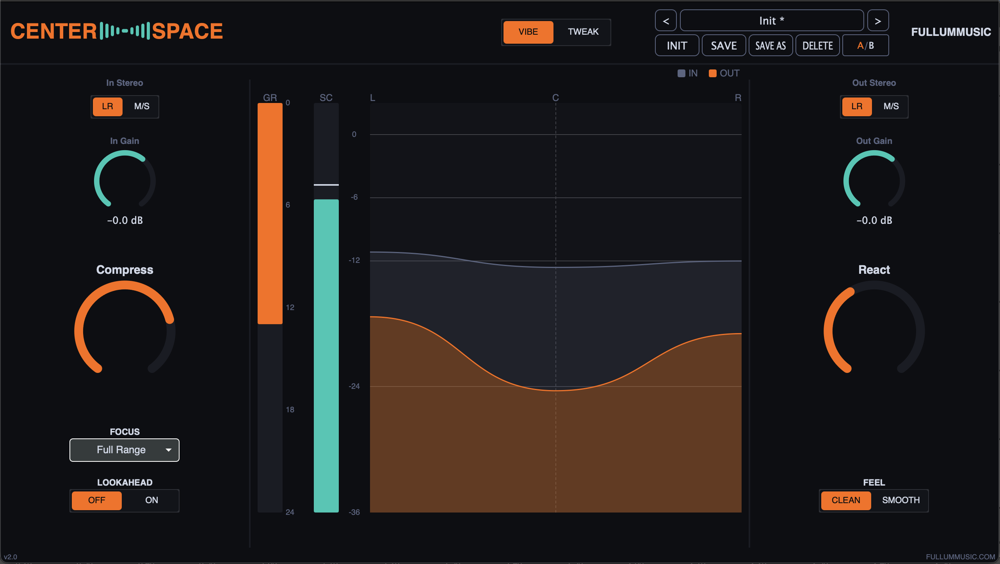
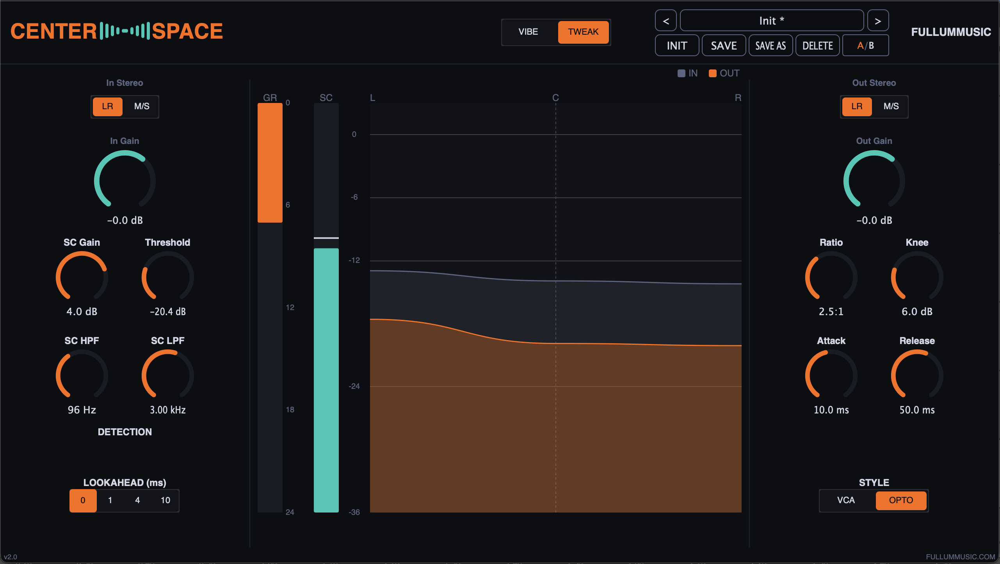
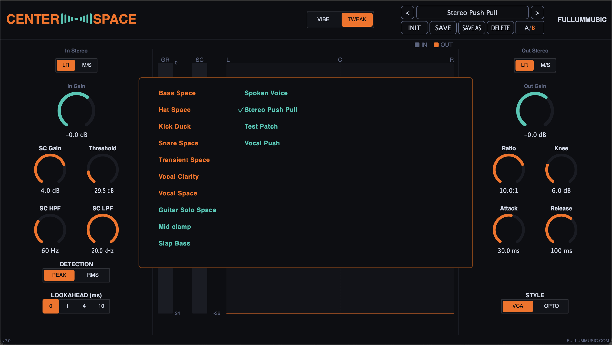
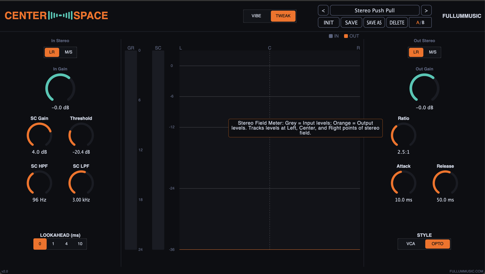
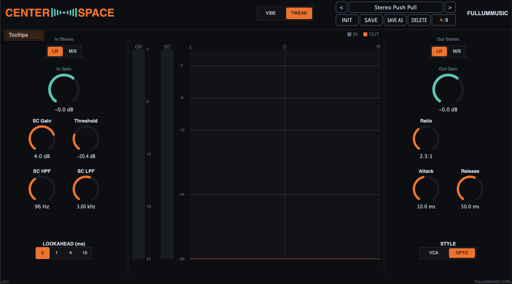

# Center Space

[](https://github.com/RFullum/Center-Space-Compressor/releases/latest)

A stereo sidechain compressor that only compresses the **center** of the stereo field.

If no signal hits the sidechain, the compressor does nothing — but the M/S encode/decode and input/output gain still run, so you can also use Center Space as a stereo-type converter on its own.



---

## Features

- **Two UI modes**:
  - **Vibe** — macro controls (`Compress`, `React`, `Focus`, `Feel`, `Lookahead On/Off`). Quick to dial in.
  - **Tweak** — full sidechain compressor with Threshold, Ratio, Knee, Attack, Release, SC HPF/LPF, SC Gain, Peak/RMS detection, Style, and Lookahead time.

  
- **9 Focus presets** for the sidechain filter pair (Full Range, Reduce Bass, Vocal, Kick, Bass, Transients, Low, Mid, High).
- **Two compressor styles** — Modern VCA (clean) and Opto (smooth, soft-knee, RMS).
- **Lookahead** — 0, 1, 4, or 10 ms. Reports latency to the host.
- **M/S input + output conversion** — feed L/R or already-encoded M/S; output as either.
- **Patch system** — factory presets included, user patches save to `~/Library/Application Support/FullumMusic/Center Space/Patches/` as `.cspatch` files. Browse with a grid-style popup picker.

  
- **A/B compare** — two independent snapshot slots with implicit-copy semantics.
- **Custom metering** — sidechain level (with peak-hold), gain reduction, and a stereo-field meter that shows input and output at the L/C/R points of the field.
- **Tooltips on every control**, toggleable via the title-bar right-click menu.

  

  

---

## System Requirements

**macOS**

- macOS 11 (Big Sur) or later
- Universal binary (Apple Silicon + Intel)
- Formats: **VST3**, **AU**

**Linux**

- 64-bit x86_64 distribution with **glibc 2.41 or newer**. The build is produced
  on Debian 13 (trixie); current rolling/recent distros (Debian 13, Ubuntu 25.04+,
  recent Fedora/Arch) work, but older LTS releases (e.g. Ubuntu 24.04, Debian 12)
  ship an older glibc and will not load it.
- A standard desktop audio/GUI stack (ALSA or JACK, X11, FreeType, Fontconfig) —
  present on any typical desktop Linux.
- Format: **VST3** (no AU — that format is macOS-only)
- ARM (aarch64) Linux is not currently provided; the build is x86_64 only.

**Windows**

- 64-bit Windows 10 or 11 (x64).
- Self-contained — the Visual C++ Redistributable is **not** required (the MSVC
  runtime is statically linked into the plug-in).
- Format: **VST3** (no AU — that format is macOS-only)
- ARM (aarch64) Windows is not currently provided; the build is x64 only.

---

## Download

Grab the latest build from the [Releases page](https://github.com/RFullum/Center-Space-Compressor/releases/latest).

**macOS** — the `.pkg` installs VST3 and AU plug-ins. Signed and notarized.

**Linux** — download the `…-Linux-x86_64.vst3.tar.gz` and extract the bundle into
your personal VST3 folder:

```sh
mkdir -p ~/.vst3
tar -xzf CenterSpace-2.0.0-Linux-x86_64.vst3.tar.gz -C ~/.vst3
```

Then rescan plug-ins in your DAW. For a system-wide install, extract into
`/usr/lib/vst3` instead (needs `sudo`). See the System Requirements above for the
glibc baseline.

**Windows** — download the `…-Windows-x86_64.vst3.zip` and extract the
`Center Space.vst3` folder into the standard system VST3 directory:

```
C:\Program Files\Common Files\VST3\
```

Right-click the downloaded zip → **Extract All…**, then move the extracted
`Center Space.vst3` folder into that location (you'll be prompted for
administrator permission, since it's under `Program Files`). Then rescan
plug-ins in your DAW. Because the build is unsigned, your browser may warn that
the zip is "not commonly downloaded" — choose **Keep**. If extraction is
blocked, right-click the zip → **Properties** → tick **Unblock** → **OK** first.

---

## Where files land after install

**macOS**

- VST3 → `/Library/Audio/Plug-Ins/VST3/Center Space.vst3`
- AU → `/Library/Audio/Plug-Ins/Components/Center Space.component`

User patches live at:
`~/Library/Application Support/FullumMusic/Center Space/Patches/`

**Linux**

- VST3 → `~/.vst3/Center Space.vst3` (or `/usr/lib/vst3/` system-wide)

User patches live at:
`~/.config/FullumMusic/Center Space/Patches/`

**Windows**

- VST3 → `C:\Program Files\Common Files\VST3\Center Space.vst3`

User patches live at:
`%APPDATA%\FullumMusic\Center Space\Patches\`

Factory patches travel inside the plugin bundle and are read-only.

---

## Building from Source

Requires CMake ≥ 3.22 and a C++20 compiler. JUCE 8 is vendored as a git submodule.

Clone with submodules:

```sh
git clone --recurse-submodules https://github.com/RFullum/Center-Space-Compressor.git
cd Center-Space-Compressor
```

If you already cloned without `--recurse-submodules`:

```sh
git submodule update --init --recursive
```

### macOS

```sh
cmake --preset=macos
cmake --build --preset=macos-release
```

For development iteration, use `--preset=macos-debug` instead.

Build a specific format:

```sh
cmake --build --preset=macos-release --target CenterSpace_VST3
cmake --build --preset=macos-release --target CenterSpace_AU
cmake --build --preset=macos-release --target CenterSpace_Standalone
```

### Linux

Uses the Ninja Multi-Config generator with the system compiler (GCC). Install the
JUCE build dependencies first (Debian/Ubuntu names shown):

```sh
sudo apt install build-essential ninja-build cmake \
    libasound2-dev libjack-jackd2-dev \
    libfreetype-dev libfontconfig1-dev \
    libx11-dev libxext-dev libxinerama-dev libxrandr-dev libxcursor-dev \
    libxcomposite-dev libxrender-dev libgl-dev libcurl4-openssl-dev
```

Configure and build the VST3 (the only format released for Linux):

```sh
cmake --preset=linux
cmake --build --preset=linux-release --target CenterSpace_VST3
```

The build installs the plug-in to `~/.vst3/Center Space.vst3`. For development
iteration, use `--preset=linux-debug` instead.

### Windows

Requires **Visual Studio 2026** (the v18 toolset) with the *Desktop development
with C++* workload. The bundled CMake works — either add it to your `PATH` or
run from a *Developer PowerShell for VS*. The plug-in links the MSVC runtime
statically, so the resulting VST3 needs no Visual C++ Redistributable.

Configure and build the VST3 (the only format released for Windows):

```powershell
cmake --preset=windows
cmake --build --preset=windows-release --target CenterSpace_VST3
```

The build does **not** auto-install on Windows (the system VST3 folder needs
admin rights). Copy `build\windows\CenterSpace_artefacts\Release\VST3\Center Space.vst3`
into `C:\Program Files\Common Files\VST3\` yourself, or load it from the build
tree in your DAW. For development iteration, use `--preset=windows-debug`.

---

## License

See [LICENSE.txt](LICENSE.txt). Third-party component notices are in [THIRD_PARTY_NOTICES.txt](THIRD_PARTY_NOTICES.txt).

---

## Credits

Center Space is by **Robert Fullum** / [FullumMusic](https://www.fullummusic.com).

Built with [JUCE 8](https://juce.com). Includes the [sigslot](https://github.com/palacaze/sigslot) signal/slot library (MIT).
